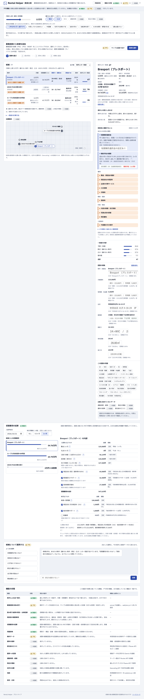

# NEST — Explainable Rental Decision Demo

[日本語](README.md) | [English](README.en.md)

**[▶ Open the Live Demo](https://sodashikenn.github.io/rental-decision-demo/)**



NEST is a front-end prototype for comparing rental homes through daily routines, priorities, and acceptable trade-offs—not only rent, floor plan, and distance from a station.

The goal is not to output a single opaque “best” property. It helps a user understand why a candidate fits, what must be compromised, and what should be verified next.

## What the demo shows

- Uploads and previews PNG, JPEG, or WEBP rental sheets locally in the browser
- With the extraction server configured (Cloudflare Worker + Claude), reads the property name, rent, address, station, layout, floor area, and construction year from the image, showing each field's confidence, printed source text, and evidence region
- Marks low-confidence fields, fields that could not be read, and inconsistencies within the sheet (for example, a summary area that disagrees with the floor plan) as needing review, and blocks the candidate until a person checks them against the original
- Adds the uploaded listing as a provisional candidate while clearly marking route and neighborhood data as missing, and records the extraction method, timestamps, and human corrections as its source
- Re-ranks candidates from a monthly budget and up to two non-negotiable priorities
- Compares commute time, late-night shopping, quietness, and workspace suitability
- Explains the fit, trade-offs, and questions to check during a viewing
- Updates rent-history charts and resident-review cards with the selected candidate
- Answers trade-off questions such as “What if I reduce the rent by ¥10,000?”
- Displays Google Maps when a Maps JavaScript API key is configured

### What is real, simulated, or planned

|Feature|Status|
|---|---|
|Listing-sheet extraction|**Real when the extraction server is configured.** The Cloudflare Worker in `server/` reads the sheet with `claude-opus-5` and returns confidence, source text, and evidence regions. Confidence is reported by the model and is not calibrated|
|Extraction on the public demo (GitHub Pages)|**Fixed sample values.** `extractionApiUrl` in `web/env.js` is blank, so the image is never sent anywhere and the values shown are unrelated to it|
|Extraction server in mock mode|**Fixed test response** matching the fictional sheet `server/tests/fixtures/listing-sheet.png`; labelled MOCK on screen|
|Properties, routes, rent histories, reviews, facility scores|**Fictional demo data**|
|Chat|**Rule-based** (not an LLM)|
|Routes / Places / Geocoding, persistence|**Not implemented.** Data is lost on reload|

With the extraction server, the browser downscales the image and sends it through the Worker to Anthropic's Claude API. The Worker does not store the image; it exists only in memory for the duration of the request, and Anthropic's API data policy applies. The page states this before anything is sent.

## Run locally

The front end (`web/`) is static files with no build step and no dependencies. Run commands from the repository root (Node.js 22 or later, Python 3).

```bash
npm run dev:web          # http://localhost:4173 (serves web/)
npm ci --prefix server   # first time only: server dependencies
npm test                 # front-end and server unit tests
```

Use that URL rather than opening `index.html` with `file://`. In this setup, listing-sheet extraction uses fixed sample values.

On every push to `main`, GitHub Actions (`.github/workflows/pages.yml`) runs the tests and then publishes only `web/` to GitHub Pages.

## Extraction server (server/)

A Cloudflare Worker that serves `POST /api/extract-listing` (`multipart/form-data`, field `image`).

```bash
cp server/.dev.vars.example server/.dev.vars   # defaults to EXTRACTION_MODE=mock (no API key, no cost)
npm run dev:server                              # http://localhost:8787
npm run smoke                                   # send the fictional sheet and compare with the ground truth
```

To use it from the front end, set `extractionApiUrl: "http://localhost:8787"` in your local `web/env.js` (do not commit it). To extract with Claude for real, set `EXTRACTION_MODE=live` and `ANTHROPIC_API_KEY` in `server/.dev.vars`. Every extraction is billed.

Deploy:

```bash
cd server
npx wrangler login
npx wrangler secret put ANTHROPIC_API_KEY
npm run deploy
```

Setting the deployed URL as `extractionApiUrl` in `web/env.js` enables extraction on the public demo. That exposes a paid API to the public, so decide based on expected traffic and cost.

**Response shape:** each entry in `fields` has `value` (`null` when it cannot be read), `confidence` (0–1, reported by the model), `evidence` (a normalized `[x, y, width, height]` box on the image), and `sourceText` (the text as printed). `warnings` lists inconsistencies within the sheet or illegible text, and `meta` carries the extraction mode, model, and timestamp.

**Safeguards and cost controls:**

- The API key lives only in the Worker's secrets and never reaches the browser
- File type is determined from the file's leading bytes, not its extension (PNG, JPEG, WEBP; up to 5 MB)
- Images are kept within the size Claude processes without resizing (2576 px long edge, 4784 visual tokens), and the API is told to reject rather than resize (`oversized_image: "error"`), so evidence coordinates stay aligned
- CORS is returned only for allowed origins; requests are limited to 5 per minute per IP; `max_tokens`, a 60-second timeout, and a kill switch (`EXTRACTION_ENABLED=false`) are set
- Logs contain only the document ID, latency, and token counts, never image content or extracted values
- Server-side fallbacks (`fallbacks: "default"`) handle the case where the model declines a request for safety reasons
- Setting a spend limit in the Anthropic Console is recommended

Estimated cost (not yet measured): about 5,000 input tokens (roughly 3,000 of them for the image) plus a few thousand output tokens, or roughly US$0.05–0.15 per extraction.

## Environment and API keys

Prepare a local environment file for future server-side integrations:

```bash
cp .env.example .env
```

The front end does not read `.env`. The file is reserved for future server-side integrations such as Routes, Places, licensed property data, or a chat LLM. The extraction server's secrets go in `server/.dev.vars` locally and in `wrangler secret put` for production; both stay out of Git.

The public `web/env.js` contains only a blank key and a blank `extractionApiUrl`. The file is published with the site, so it must never hold secrets. To test map rendering locally, temporarily add a browser key restricted by HTTP referrer and API scope, and never commit a real key.

## Integrations required for a real service

|Purpose|Candidate integration|Design requirement|
|---|---|---|
|Property inventory|Licensed or contract-authorized property feed|Track property ID, listing date, address, rent, and floor plan|
|Rental-sheet structuring|Cloudflare Worker + Claude (**implemented**, `server/`)|Process images temporarily and return field-level confidence and evidence regions for human confirmation|
|Address resolution|Geocoding API|Convert an address or Place ID into coordinates|
|Map display|Maps JavaScript API|Restrict the browser key by HTTP referrer and API scope|
|Commute and daily routes|Routes API|Compare candidate–destination pairs with `computeRouteMatrix`, retaining weekday, departure time, and travel mode as evidence|
|Nearby facilities|Places API (New)|Request only user-selected categories, distances, opening hours, and necessary fields|
|Rent history and reviews|A source that explicitly permits reuse|Separate asking rent from contracted rent and show source and retrieval date|

The product is not designed to scrape third-party property or review sites without permission. Workplace, home address, and routine data should remain optional, with an explicit purpose and retention policy.

Official references: [Maps JavaScript API](https://developers.google.com/maps/documentation/javascript/get-api-key) / [Routes API](https://developers.google.com/maps/documentation/routes) / [Places API (New)](https://developers.google.com/maps/documentation/places/web-service/nearby-search) / [Geocoding API](https://developers.google.com/maps/documentation/geocoding)

## Product principles

1. **Ask for constraints first** — Define exclusion boundaries such as total budget and maximum commute time.
2. **Limit priorities** — Keeping non-negotiables to two prevents an unhelpful list of equally weighted criteria.
3. **Translate compromise into daily impact** — Express a rent difference as a change in commute time or routine.
4. **Separate evidence from interpretation** — Present fit, source data, and caveats independently so the ranking can be challenged.
5. **Show data limitations** — Do not mix fictional data, asking rent, contracted rent, and subjective reviews.

## Architecture

The front end (`web/`) and the extraction server (`server/`) are separate, and both follow the same conventions as [LLM-RAG_KBQA](https://github.com/SodaShikenn/LLM-RAG_KBQA). An `app.js` factory initializes extensions (`extensions/ext_*.js`) and registers feature apps (`apps/<name>/`). Settings live in `config.js`, and shared helpers in `helper.js`.

```text
.
├── package.json              # dev and test commands (no dependencies)
├── .github/workflows/        # tests (ci.yml) and GitHub Pages publishing (pages.yml)
├── assets/demo.png           # README preview (uses the fictional sheet)
├── web/                      # front end (static files, published to GitHub Pages)
│   ├── index.html            # page structure
│   ├── app.js                # entry: initialize extensions, register apps
│   ├── config.js             # settings (reads values from env.js)
│   ├── env.js                # per-deployment values (Maps key, server URL; never secrets)
│   ├── helper.js             # shared helpers (currency, escaping, …)
│   ├── extensions/           # ext_store (state and change events), ext_google_maps
│   ├── apps/
│   │   ├── shortlist/        # routine preferences, candidate ranking, map pins
│   │   ├── insights/         # selected-candidate reasons, rent history, reviews
│   │   ├── chat/             # rule-based analysis chat
│   │   └── intake/           # listing-sheet upload and extraction review
│   ├── static/               # CSS and favicon
│   └── tests/                # unit tests (node:test)
└── server/                   # extraction server (Cloudflare Worker)
    ├── wrangler.jsonc        # Worker config (rate limit, allowed origins, mode)
    ├── src/
    │   ├── index.js          # Worker entry
    │   ├── app.js            # entry: extensions, blueprint registration, shared CORS, errors, logging
    │   ├── config.js         # settings (model, limits, environment parsing)
    │   ├── helper.js         # shared helpers (AppError, JSON responses)
    │   ├── extensions/       # ext_anthropic, ext_cors, ext_logger, ext_rate_limit
    │   └── apps/listing/     # listing-sheet extraction API
    │       ├── index.js      # routes and before-request hooks (kill switch, rate limit)
    │       ├── views.js      # request handling
    │       ├── forms.js      # image validation
    │       ├── services.js   # Claude call
    │       ├── prompts.js    # prompts
    │       ├── models.js     # response schema and public contract
    │       └── mock.js       # mock reading
    ├── commands/smoke.js     # ground-truth comparison command
    └── tests/                # unit tests and the fictional fixture sheet
```

Every app uses the same file roles:
- `index.js` registers the app;
- `views.js` handles the DOM (or HTTP);
- `services.js` holds logic that doesn't touch the DOM and is unit tested;
- `models.js` holds data definitions.

### Adding a feature

- **Front end:** define `initApp(app)` in `web/apps/<name>/index.js` and add the module to `APPS` in `web/app.js`. Read state from `app.extensions.store` and react to changes with `store.on("change", ...)`.
- **Server API:** define `bp` (`prefix`, `routes`, `beforeRequest`) in `server/src/apps/<name>/index.js` and add it to `BLUEPRINTS` in `server/src/app.js`.
- **External service:** define `initApp(app)` in `extensions/ext_<name>.js` and call it from `initializeExtensions` in the matching `app.js`. In tests, replace it with `createApp(env, { <name>: stub })`.
- **Settings:** fixed values go in `config.js`. Per-deployment values go in `web/env.js` (browser) or in `wrangler.jsonc` and Worker secrets (server).

## Verified interactions

- Re-ranking after preference changes
- Image upload, preview, sample extraction, and provisional-candidate insertion
- Extraction through the server (mock mode): confidence and evidence display, review of flagged fields, and source recording
- Error, connection-failure, and malformed-response handling, with an explicit switch to sample values
- Candidates with unknown rent are not treated as within budget (they get a neutral provisional score)
- Synchronized explanation, rent chart, and reviews after candidate selection
- Chat responses to trade-off questions (typed input is never interpreted as HTML)
- Responsive desktop and mobile layouts
- Unit tests (`npm test`) for scoring, the image resize rule, review flags, provenance text, chat answers, and the server's validation, Claude call, and routing
- Graceful fallback to the mock map without an API key

## Next steps

- Compare travel time by weekday, departure time, and mode with Routes API
- Evaluate access to groceries, healthcare, childcare, and restaurants with Places API
- Replace demo inventory and rent histories with licensed data
- Persist confirmed candidates with a versioned property schema
- Add an evidence-grounded LLM chat and post-viewing feedback loop
