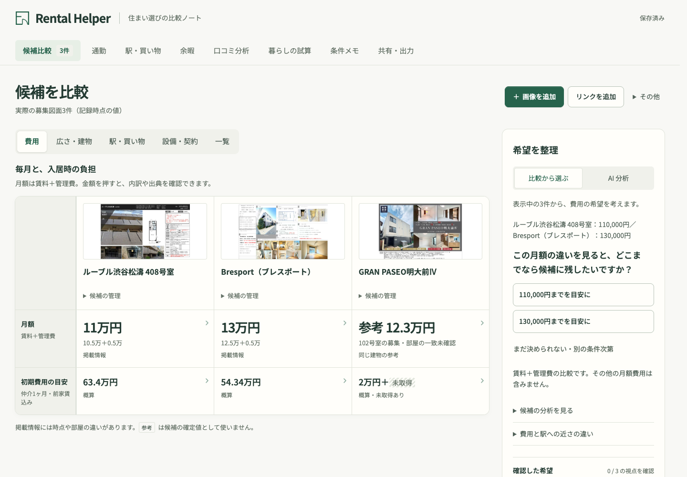
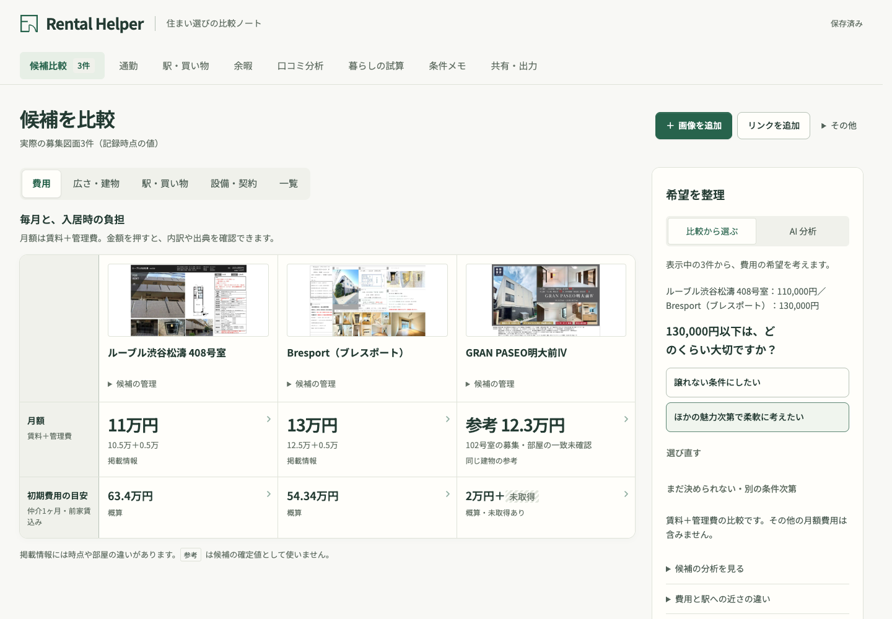
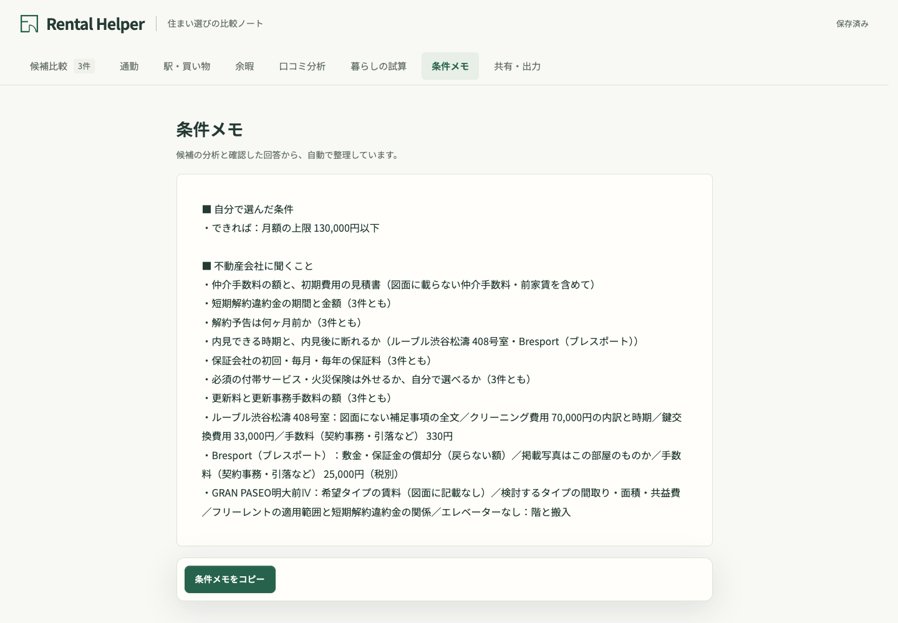
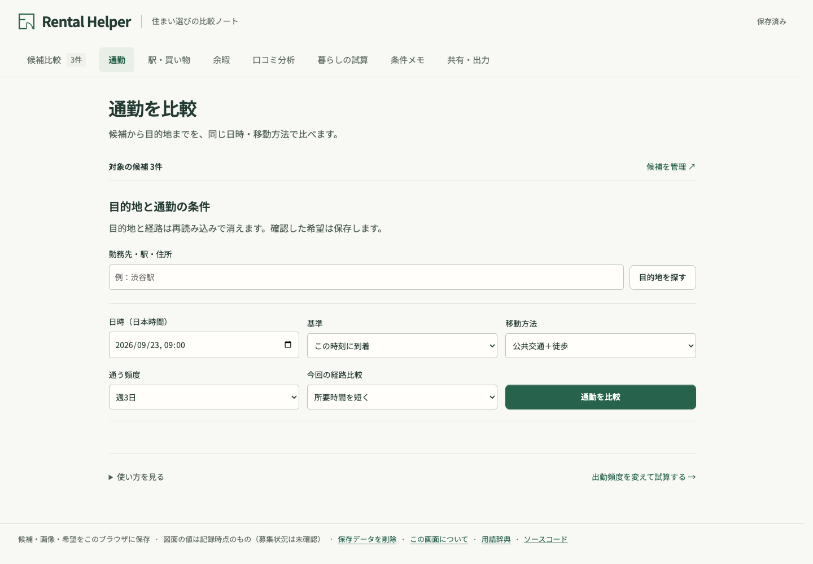
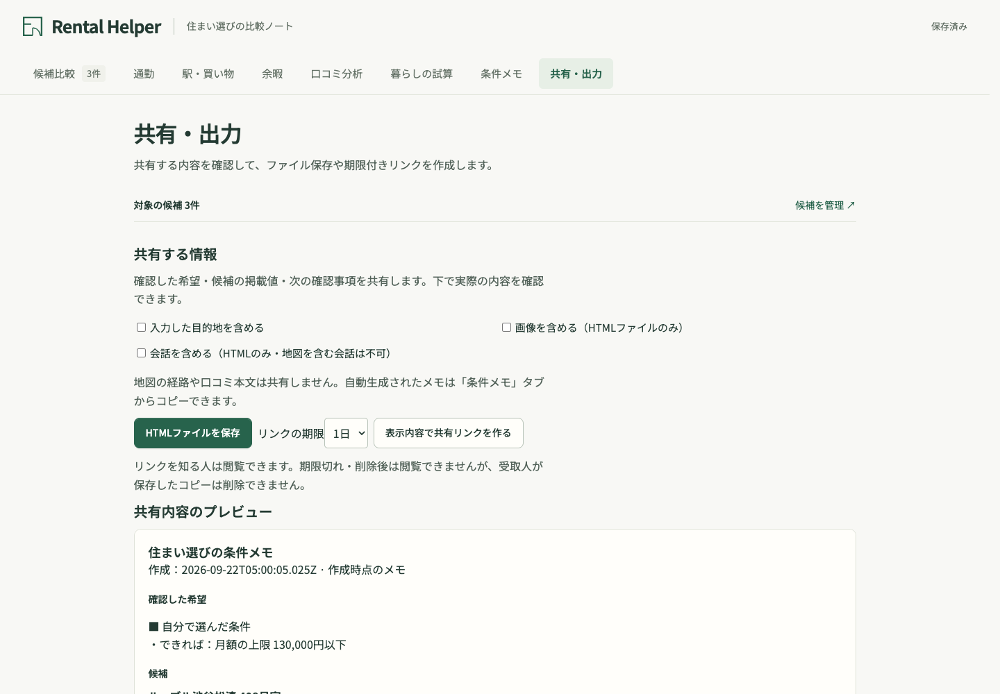
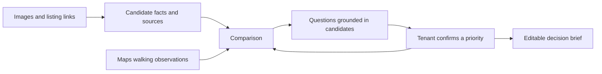

# Rental Helper

**Compare homes. Discover what matters. Make a decision you can explain.**

Rental Helper helps tenants in Japan turn apartment images and listing links into a comparison, an interactive conversation about their priorities, and a brief they can take to a viewing or agent. The experience starts with the homes they are considering—not a blank requirements form.

[日本語](README.ja.md) · [Public demo — static experience](https://sodashikenn.github.io/rental-helper/) · [Current walkthrough](#try-the-three-step-journey) · [Roadmap](ROADMAP.md) · [Run locally](docs/DEVELOPMENT.md#run-locally)

> **Development prototype · September 22, 2026.** Screenshots show the current local build. The public demo hosts the static frontend; API-backed features need a separately configured server. Live AI, listing research and Maps require a configured backend; the recorded comparison and numeric preference flow work without those services.

## The project in 60 seconds

A tenant can find attractive apartments but still struggle to answer: “Which differences matter to my daily life?” Listings omit details, monthly charges can be unclear, and “close to a station” says little about a real commute.

Rental Helper brings candidate facts and sources together, asks focused questions about concrete differences, and waits for the tenant to confirm a preference before using it. Unknowns remain visible. The tenant keeps control of the decision.

| If you are… | Start here |
| --- | --- |
| A recruiter | [Three-step walkthrough](#try-the-three-step-journey), then [skills demonstrated](#what-this-project-demonstrates). |
| A product or design reviewer | [Product principles](PRODUCT.md), [interface decisions and interaction checks](docs/UI_DESIGN.md), then [upcoming user journeys](ROADMAP.md). |
| An engineering reviewer | [8-step code tour](docs/CODE_TOUR.md), [architecture and setup](docs/DEVELOPMENT.md), and [validation](docs/VALIDATION.md). |

## Find a feature

Desktop: choose a top tab. Mobile: use **機能を選ぶ**. Each page puts its controls first, with usage tips under **使い方を見る**; switching pages preserves current drafts and retrieved results until reload.

| Open the demo at… | What to do there |
| --- | --- |
| [候補比較 — compare](https://sodashikenn.github.io/rental-helper/#compare) | Add images/links, compare facts, and confirm candidate-based priorities with AI or numeric questions. |
| [通勤 — commute](https://sodashikenn.github.io/rental-helper/#commute) | Confirm a work destination and compare scheduled routes. |
| [駅・買い物 — essentials](https://sodashikenn.github.io/rental-helper/#surroundings) | Check each candidate's listed walking claims against Maps. |
| [余暇 — leisure](https://sodashikenn.github.io/rental-helper/#leisure) | Find nearby parks, gyms and cafés before discussing preferences. |
| [口コミ分析 — review analysis](https://sodashikenn.github.io/rental-helper/#reviews) | Automatically search public web reviews for a candidate, inspect sources/unit scope, and use the resulting analysis without writing requirements. |
| [暮らしの試算 — scenarios](https://sodashikenn.github.io/rental-helper/#scenarios) | Change weekly commuting frequency and compare the tradeoffs. |
| [条件メモ — brief](https://sodashikenn.github.io/rental-helper/#needs) | Read and copy the generated decision brief. |
| [共有・出力 — share/export](https://sodashikenn.github.io/rental-helper/#sharing) | Preview included information, download HTML or manage expiring links. |

Live research, Maps, AI and hosted sharing require a configured API; the public demo exposes the same interface.

## Try the three-step journey

The app has eight directly accessible feature tabs. On phones, the **機能を選ぶ** dropdown exposes the same pages. Comparison and discovery stay together in **候補比較**, with separate pages for routes, surroundings, reviews, scenarios, the memo and sharing. Use cost, space, access, equipment/contracts or full-list views; questions stay beside the evidence. On mobile, select two candidates and open the questions in a bottom panel. Each screenshot below opens at full size; expand the steps for a guided tour. [Run this version locally](docs/DEVELOPMENT.md#run-locally) to interact with it.

| 01 · Compare / 比較する | 02 · Discover / 希望を整理する | 03 · Takeaway / メモを持ち出す |
| --- | --- | --- |
|  |  |  |
| Understand differences and inspect sources. | Confirm a priority through a question. | Copy and revisit the automatically generated brief. |

<strong>01 — Compare: what is known, and where did it come from?</strong>

Open the comparison and click a monthly cost or initial-cost estimate. See the amount, breakdown and evidence; extraction details are available when needed. Add an image or listing link without having to complete every missing field first.

**Try GRAN PASEO明大前Ⅳ:** its brochure omits rent and does not identify a room. The app shows **参考 12.3万円/月** from a sourced offer for 102号室. It explains that this is a same-building reference, so it is excluded from the candidate's confirmed budget and initial-cost calculation.

With the backend configured, missing monthly charges trigger research automatically. Exact-unit, current, non-conflicting offers can fill gaps; other-room prices remain references. Maps can separately compare listed station/amenity walking claims with provider estimates.

<strong>02 — Discover: turn a vague preference into a confirmed choice</strong>

In **候補比較**, select **AI 分析** in the side panel (on mobile, open **この違いから希望を整理** first). With Gemini available, start candidate analysis: the conversation asks one evidence-linked question, offers choices and deferral, and proposes priorities for explicit acceptance.

For a no-key walkthrough, use **費用 → 比較から選ぶ**. Pick a candidate-derived monthly budget, then choose whether it is a must-have or flexible preference. A tentative choice alone does not update requirements. After confirmation, inspect each candidate's fit, conflict or unknown state.

The screenshots use this real numeric fallback; they do not depict a fabricated live AI conversation.

<strong>03 — Takeaway: leave with a useful next action</strong>

Open **条件メモ**. The memo combines confirmed priorities, selected equipment and questions to check with an agent. Copy it; revise preferences through candidate-based questions. Reload to confirm that local candidates, preferences and confirmed answers survive.

Saving is specific to this browser. Maps observations and conversations containing them are temporary; accepted preferences persist. Open the **共有・出力** tab to preview the brief, download HTML, or create a 1–7 day link with a connected backend. The creator can revoke the link; downloaded copies remain with recipients.

<strong>Explore the new modules: commute, leisure, reviews and sharing</strong>

- **通勤:** find and confirm a destination, set a Japan-time schedule, then compare returned journeys. Confirm the route objective only after seeing evidence.
- **余暇:** retrieve actual options first, choose an activity/frequency, then explicitly accept its importance. “None” and “not sure” are valid.
- **暮らしの試算:** vary days per week and see which explanations change. Missing rent/routes stay unknown.
- **口コミ分析:** select a candidate; the app searches the room, then its building, then up to three Maps-verified neighboring residences within 300 m. Read source-linked summaries with the actual building and distance, then choose which concerns matter. If none are found, the review area stays blank.
- **共有・出力:** review exactly which fields are included. Images/chat are optional local HTML attachments; hosted links use a smaller allowlisted document.

These screenshots show the actual forms and preview, without fabricated provider results.

[Follow the implementation through the repository →](docs/CODE_TOUR.md)

## What is working today

| Capability | Current state |
| --- | --- |
| Image / listing URL / manual candidate input | Implemented; extraction and online retrieval require the backend. |
| Comparison, cost breakdowns, evidence and glossary | Implemented; recorded examples work without provider keys. |
| Automatic missing-price research | Implemented with source, unit-match and conflict checks; recorded GRAN PASEO reference included. |
| Station and grocery walking checks | Geocoding + Places (New) + WALK Routes integrated; previous local live checks succeeded. |
| Candidate-based AI conversation | Implemented with cited context and explicit preference confirmation; live-provider reliability remains under evaluation. |
| Preference fit, generated memo and local saving | Implemented; IndexedDB includes uploaded images and eligible conversation history. |
| Commute and scenario comparison | Implemented; one confirmed destination/schedule, alternatives and explicit priorities. Live Tokyo transit query returned **no routes**; Maps fallback and coverage follow-up remain. |
| Leisure discovery | Implemented; real parks/gyms/cafés, optional regular destination, frequency/importance confirmation. Live park/WALK slice succeeded. |
| Automatic review analysis | Implemented: room → building → nearby residential references within 300 m. Empty evidence stays blank; no manual diary or requirement entry. Live GRAN PASEO search returned Gemini busy; successful retrieval and source coverage still need validation. |
| Brief export and sharing | HTML preview/download; backend links expire in 1–7 days and support revocation. Public sharing requires API hosting. |

**Validation:** 229 tests passed on September 22, 2026: 103 frontend and 126 backend; 2 real-OCR tests skipped. Browser checks cover desktop/mobile, pair selection, keyboard navigation, confirmation, persistence, source details, and stale AI response rejection with a stubbed provider. Earlier checks also covered automatic research. Recent full-candidate Gemini calls returned service-busy responses, so full live conversational/research quality is not claimed. [Detailed validation record](docs/VALIDATION.md).

## What this project demonstrates

| Skill | Concrete evidence in the project |
| --- | --- |
| Product judgment | Reframed an OCR examination tool around the tenant's decision; removed upfront requirements writing and kept uncertainty visible. |
| Full-stack implementation | Modular JavaScript UI, FastAPI services, structured data contracts, external APIs and browser persistence. |
| Responsible AI integration | Evidence IDs, source/room matching, explicit confirmation, stale-response rejection and honest failure states. |
| UX design | Comparison and contextual questions together, visible priorities, mobile pair selection, keyboard navigation and evidence details. |
| Testing and delivery | Pure-function/API tests, provider stubs, browser checks, Docker setup and GitHub Actions workflows. |

The project demonstrates implemented engineering decisions. It does not yet claim production adoption, measured tenant outcomes or comprehensive AI accuracy.

## Explore the implementation

<strong>Open the technical path: UI → services → evidence → tests</strong>

| Layer | Stack / entry point |
| --- | --- |
| Frontend | HTML, CSS, JavaScript ES modules; no frontend build step. [App factory](web/app.js), [workspace](web/apps/workspace/index.js). |
| Backend | Python/FastAPI, Pydantic, Gemini SDK. [App factory](server/app.py). |
| Extraction | Docling + RapidOCR → Gemini field mapping → evidence validation. [Listing service](server/apps/listing/services.py). |
| Research | Grounded search/URL context, unit identity and guarded updates. [Backend](server/apps/research/services.py), [automatic monthly flow](web/apps/research/automatic.js). |
| Maps | Geocoding, Places (New), WALK Routes. [Maps service](server/apps/maps/services.py). |
| Advice | Structured, cited questions and preference proposals. [Advisor service](server/apps/advisor/services.py). |
| Storage | Local IndexedDB, including image blobs. [Session implementation](web/extensions/session.js). |
| Quality | [Frontend tests](web/tests), [backend tests](server/tests), [CI workflow](.github/workflows/ci.yml). |

[Setup, environment variables, API endpoints and deployment](docs/DEVELOPMENT.md).

## What comes next

The feature modules are implemented; the remaining work is provider coverage and release validation:

1. Obtain and validate usable public-transit routes for representative Japanese commutes.
2. Validate automatic web-review retrieval against real apartment buildings and evaluate source coverage.
3. Deploy the API with durable share storage; verify public access, expiry and revocation.
4. Evaluate live Gemini quality, provider latency/cost and tenant usability.

[Implementation vs. remaining acceptance criteria →](ROADMAP.md)
