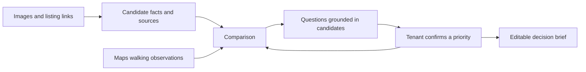

# Rental Helper

**Compare homes. Discover what matters. Make a decision you can explain.**

Rental Helper helps tenants in Japan turn apartment images and listing links into a comparison, an interactive conversation about their priorities, and a brief they can take to a viewing or agent. The experience starts with the homes they are considering—not a blank requirements form.

[日本語](README.ja.md) · [Public demo — earlier UI](https://sodashikenn.github.io/rental-helper/) · [Current walkthrough](#try-the-three-step-journey) · [Roadmap](ROADMAP.md) · [Run locally](docs/DEVELOPMENT.md#run-locally)

> **Development prototype · September 22, 2026.** Screenshots show the current local build. The public demo still serves an earlier interface. Live AI, listing research and Maps require a configured backend; the recorded comparison and numeric preference flow work without those services.

## The project in 60 seconds

A tenant can find attractive apartments but still struggle to answer: “Which differences matter to my daily life?” Listings omit details, monthly charges can be unclear, and “close to a station” says little about a real commute.

Rental Helper brings candidate facts and sources together, asks focused questions about concrete differences, and waits for the tenant to confirm a preference before using it. Unknowns remain visible. The tenant keeps control of the decision.

| If you are… | Start here |
| --- | --- |
| A recruiter | [Three-step walkthrough](#try-the-three-step-journey), then [skills demonstrated](#what-this-project-demonstrates). |
| A product or design reviewer | [Product principles and current progress](PRODUCT.md), then [upcoming user journeys](ROADMAP.md). |
| An engineering reviewer | [Architecture and setup](docs/DEVELOPMENT.md), [source map](#explore-the-implementation), and [validation](#what-is-working-today). |

## Try the three-step journey

The current app keeps comparison and discovery in one workspace, with a separate decision brief. Use cost, space, access, equipment/contracts or full-list views; questions stay beside the evidence. On mobile, select two candidates and open the questions in a bottom panel. Each screenshot below opens at full size; expand the steps for a guided tour. [Run this version locally](docs/DEVELOPMENT.md#run-locally) to interact with it.

| 01 · Compare / 比較する | 02 · Discover / 希望を整理する | 03 · Takeaway / メモを持ち出す |
| --- | --- | --- |
|  |  |  |
| Understand differences and inspect sources. | Confirm a priority through a question. | Edit, copy and revisit the brief. |

<strong>01 — Compare: what is known, and where did it come from?</strong>

Open the comparison and click a monthly cost or initial-cost estimate. See the amount, breakdown and evidence; extraction details are available when needed. Add an image or listing link without having to complete every missing field first.

**Try GRAN PASEO明大前Ⅳ:** its brochure omits rent and does not identify a room. The app shows **参考 12.3万円/月** from a sourced offer for 102号室. It explains that this is a same-building reference, so it is excluded from the candidate's confirmed budget and initial-cost calculation.

With the backend configured, missing monthly charges trigger research automatically. Exact-unit, current, non-conflicting offers can fill gaps; other-room prices remain references. Maps can separately compare listed station/amenity walking claims with provider estimates.

<strong>02 — Discover: turn a vague preference into a confirmed choice</strong>

In **比較ワークスペース**, select **AIと深める** in the side panel (on mobile, open **この違いから希望を整理** first). With Gemini available, start candidate analysis: the conversation asks one evidence-linked question, offers choices and deferral, and proposes priorities for explicit acceptance.

For a no-key walkthrough, use **費用 → ひとつずつ確認**. Pick a candidate-derived monthly budget, then choose whether it is a must-have or flexible preference. A tentative choice alone does not update requirements. After confirmation, inspect each candidate's fit, conflict or unknown state.

The screenshots use this real numeric fallback; they do not depict a fabricated live AI conversation.

<strong>03 — Takeaway: leave with a useful next action</strong>

Open **条件メモ**. The memo combines confirmed priorities, selected equipment and questions to check with an agent. Edit and copy it. Reload to confirm that local candidates, preferences and memo edits survive.

Saving is specific to this browser. Maps observations and conversations containing them are temporary; accepted preferences persist. Cloud sharing is planned.

## What is working today

| Capability | Current state |
| --- | --- |
| Image / listing URL / manual candidate input | Implemented; extraction and online retrieval require the backend. |
| Comparison, cost breakdowns, evidence and glossary | Implemented; recorded examples work without provider keys. |
| Automatic missing-price research | Implemented with source, unit-match and conflict checks; recorded GRAN PASEO reference included. |
| Station and grocery walking checks | Geocoding + Places (New) + WALK Routes integrated; previous local live checks succeeded. |
| Candidate-based AI conversation | Implemented with cited context and explicit preference confirmation; live-provider reliability remains under evaluation. |
| Preference fit, editable memo and local saving | Implemented; IndexedDB includes uploaded images and eligible conversation history. |
| Workplace commute, leisure recommendations, resident reviews and shared comparisons | **Planned**, with acceptance criteria in [ROADMAP.md](ROADMAP.md). |

**Validation:** 169 tests passed on September 22, 2026: 86 frontend and 83 backend; 2 real-OCR tests skipped. Browser checks cover desktop/mobile, pair selection, keyboard navigation, confirmation, persistence, source details, and stale AI response rejection with a stubbed provider. Earlier checks also covered automatic research. Recent full-candidate Gemini calls returned service-busy responses, so full live conversational/research quality is not claimed. [Detailed status](PRODUCT.md#validation-and-release-state).

## What this project demonstrates

| Skill | Concrete evidence in the project |
| --- | --- |
| Product judgment | Reframed an OCR examination tool around the tenant's decision; removed upfront requirements writing and kept uncertainty visible. |
| Full-stack implementation | Modular JavaScript UI, FastAPI services, structured data contracts, external APIs and browser persistence. |
| Responsible AI integration | Evidence IDs, source/room matching, explicit confirmation, stale-response rejection and honest failure states. |
| UX design | Comparison and contextual questions together, visible priorities, mobile pair selection, keyboard navigation and evidence details. |
| Testing and delivery | Pure-function/API tests, provider stubs, browser checks, Docker setup and GitHub Actions workflows. |

The project demonstrates implemented engineering decisions. It does not yet claim production adoption, measured tenant outcomes or comprehensive AI accuracy.

## Explore the implementation

<strong>Open the technical path: UI → services → evidence → tests</strong>

| Layer | Stack / entry point |
| --- | --- |
| Frontend | HTML, CSS, JavaScript ES modules; no frontend build step. [App factory](web/app.js), [workspace](web/apps/workspace/index.js). |
| Backend | Python/FastAPI, Pydantic, Gemini SDK. [App factory](server/app.py). |
| Extraction | Docling + RapidOCR → Gemini field mapping → evidence validation. [Listing service](server/apps/listing/services.py). |
| Research | Grounded search/URL context, unit identity and guarded updates. [Backend](server/apps/research/services.py), [automatic monthly flow](web/apps/research/automatic.js). |
| Maps | Geocoding, Places (New), WALK Routes. [Maps service](server/apps/maps/services.py). |
| Advice | Structured, cited questions and preference proposals. [Advisor service](server/apps/advisor/services.py). |
| Storage | Local IndexedDB, including image blobs. [Session implementation](web/extensions/session.js). |
| Quality | [Frontend tests](web/tests), [backend tests](server/tests), [CI workflow](.github/workflows/ci.yml). |

[Setup, environment variables, API endpoints and deployment](docs/DEVELOPMENT.md).

## What comes next

1. **Work-destination routing:** compare door-to-door journeys under the same work schedule, including walking, transfers and fares when available.
2. **Leisure discovery:** use real nearby parks, gyms, cafés or a regular destination to ask what the tenant values, then confirm it interactively.
3. **Scenario recommendations:** explain tradeoffs between cost, commuting and confirmed leisure interests, with assumptions the tenant can change.
4. **Resident context and sharing:** attributed reviews, viewing questions and a shareable decision brief.

These are planned capabilities, not features shown in the current screenshots. [See the ordered backlog and definition of done →](ROADMAP.md)

[Back to top ↑](#rental-helper)
