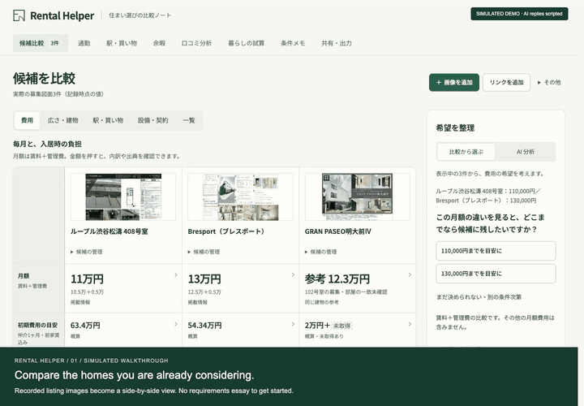
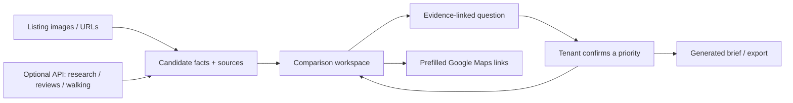

<div align="center">

# Rental Helper

### Compare homes. Discover what matters.

A candidate-first rental assistant for Japan.<br>
From listing images and links to sourced comparisons, focused questions, and a decision brief.

[**Watch the walkthrough**](https://sodashikenn.github.io/rental-helper/demo/) · [**Try the app**](https://sodashikenn.github.io/rental-helper/) · [**Read the code**](docs/CODE_TOUR.md)

[日本語](README.ja.md) · [Product design](PRODUCT.md) · [Roadmap](ROADMAP.md)

[](https://github.com/SodaShikenn/rental-helper/actions/workflows/ci.yml)
[](https://github.com/SodaShikenn/rental-helper/actions/workflows/pages.yml)

[](https://sodashikenn.github.io/rental-helper/demo/)

**[▶ Play the chaptered video](https://sodashikenn.github.io/rental-helper/demo/)** · [Download MP4](https://sodashikenn.github.io/rental-helper/demo/media/walkthrough.mp4) · [Read transcript](web/demo/media/transcript.md)

</div>

> **About the film:** a simulated journey recorded in the real interface. Listing examples are previously recorded; AI replies are scripted and labelled throughout. Confirmation, comparison, Maps link generation and HTML export use the actual application. No live model quality or current rental availability is implied. [How it was recorded](docs/DEMO.md).

## Why this exists

“I like these three apartments, but I don't know which differences matter.”

Rental Helper starts with the tenant's shortlist. It compares sourced facts, investigates gaps, and uses concrete differences to help the tenant refine vague priorities. The tenant confirms each interpretation before it changes the comparison or the brief.

**The product loop:** candidates → evidence → a focused question → explicit confirmation → a clearer decision.

## Choose your tour

| Your time | Your path |
| --- | --- |
| **90 seconds · hiring / product** | [Watch the film](https://sodashikenn.github.io/rental-helper/demo/) and see the complete decision flow. |
| **3 minutes · hands-on** | [Open the demo](https://sodashikenn.github.io/rental-helper/#compare), inspect a price, answer a numeric question and export a brief. No account or API key needed. |
| **10 minutes · engineering** | Follow the [code tour](docs/CODE_TOUR.md), inspect [evidence boundaries](PRODUCT.md), then review [tests and live checks](docs/VALIDATION.md). |

### Jump to a moment

| In the film | What it demonstrates |
| --- | --- |
| [01 · Compare the shortlist](https://sodashikenn.github.io/rental-helper/demo/#chapter=0) | Images, known values and missing information in one workspace. |
| [02 · Inspect a reference price](https://sodashikenn.github.io/rental-helper/demo/#chapter=1) | A different unit's rent never becomes this candidate's confirmed budget. |
| [03 · Ask from evidence](https://sodashikenn.github.io/rental-helper/demo/#chapter=2) | A scripted AI exchange illustrates candidate-based questions, without a requirements essay. |
| [04 · Confirm the interpretation](https://sodashikenn.github.io/rental-helper/demo/#chapter=3) | A tentative answer only changes priorities after acceptance. |
| [05 · Check a commute](https://sodashikenn.github.io/rental-helper/demo/#chapter=4) | Tokyo destinations and prefilled outbound / return Google Maps links. |
| [06–07 · Take the decision with you](https://sodashikenn.github.io/rental-helper/demo/#chapter=5) | Generated brief, explicit sharing options and a real HTML download. |

<details>
<summary><strong>See a short animated preview</strong></summary>

[](https://sodashikenn.github.io/rental-helper/demo/)

[Watch with playback controls and English / Japanese captions →](https://sodashikenn.github.io/rental-helper/demo/)

</details>

## Try the three-step journey

1. **Compare.** In [候補比較](https://sodashikenn.github.io/rental-helper/#compare), click a monthly amount to inspect the evidence. GRAN PASEO明大前Ⅳ shows a same-building reference for another unit, excluded from its confirmed budget.
2. **Discover.** Use **費用 → 比較から選ぶ** to choose a candidate-derived budget and confirm its importance. With a backend, **AI 分析** offers evidence-linked questions and proposals. The public app does not use the film's scripted AI responses.
3. **Take away.** Open [条件メモ](https://sodashikenn.github.io/rental-helper/#needs), then [共有・出力](https://sodashikenn.github.io/rental-helper/#sharing). Review the generated brief and download HTML. Preferences are refined through choices; the memo is read-only.

Desktop uses top tabs; phones use **機能を選ぶ**. Navigation preserves in-progress work.

## Find a feature

| Feature | Tenant outcome | Public demo |
| --- | --- | --- |
| [候補比較 · Compare](https://sodashikenn.github.io/rental-helper/#compare) | Compare costs, area, station claims and source evidence. | Recorded candidates, numeric questions and local saving work. Image/URL extraction and automatic missing-price research need the backend. |
| [通勤 · Commute](https://sodashikenn.github.io/rental-helper/#commute) | Choose a hub or work address; open each home's outbound/return route. | Works without an API. Endpoints and mode are prefilled; set date/time in Maps. Results are not imported. |
| [駅・買い物 · Essentials](https://sodashikenn.github.io/rental-helper/#surroundings) | Check listed walking claims against sourced Maps observations. | API required. Listing times stay distinct from provider estimates. |
| [余暇 · Leisure](https://sodashikenn.github.io/rental-helper/#leisure) | Discover parks, gyms and cafés before discussing preferences. | API required. Confirm interest, frequency and importance after seeing places. |
| [口コミ分析 · Reviews](https://sodashikenn.github.io/rental-helper/#reviews) | Search room → building → nearby references; inspect identity and scope. | API required. Missing evidence stays blank; nearby reports are not attributed to the candidate. |
| [暮らしの試算 · Scenarios](https://sodashikenn.github.io/rental-helper/#scenarios) | Compare known costs, accepted leisure interests and weekly assumptions. | Known values work. No invented commute totals or overall score. |
| [条件メモ · Brief](https://sodashikenn.github.io/rental-helper/#needs) | Carry confirmed priorities and unanswered questions into a viewing. | Generated memo and copy work. No manual diary or requirements form. |
| [共有・出力 · Export](https://sodashikenn.github.io/rental-helper/#sharing) | Preview exactly what is shared, then save or send it. | Local HTML works. Expiring, revocable links require the backend. |

## Engineering you can inspect

| Decision | Why it matters | Start reading |
| --- | --- | --- |
| **Evidence before preference** | An inference is a proposal until the tenant confirms it. | [Advisor](web/apps/advisor/) · [tests](web/tests/apps/advisor/) |
| **Keep uncertainty meaningful** | Other-unit rent, missing fees and nearby reviews cannot silently become candidate facts. | [Price research](server/apps/research/) · [review fallback](server/apps/reviews/fallback.py) |
| **Adapt to provider limits** | Japan transit is unavailable through Google Routes. Keyless Maps handoff keeps commute lookup usable. | [URL builder](web/apps/commute/links.js) · [tests](web/tests/apps/commute/links.test.js) |
| **Independent feature modules** | Controllers, pure transformations and provider adapters can be reviewed separately. | [Code tour](docs/CODE_TOUR.md) · [app factories](docs/DEVELOPMENT.md#architecture) |
| **Explicit sharing boundaries** | Temporary observations stay outside persistent shares; hosted briefs use an allowlist and revocation secret. | [Sharing service](server/apps/sharing/) · [client export](web/apps/sharing/) |
| **Repeatable verification** | Provider contracts, browser workflows and live checks answer different questions. | [Validation record](docs/VALIDATION.md) · [recording source](scripts/record-demo.mjs) |



**Stack:** JavaScript ES modules · HTML / CSS · FastAPI / Pydantic · Gemini · Docling / RapidOCR · Google Maps · IndexedDB · SQLite · Docker · GitHub Actions. The frontend has no build step or runtime framework dependency.

<details>
<summary><strong>Run locally and validate</strong></summary>

For the recorded comparison, numeric discovery, Maps handoff and local export:

```bash
npm run dev:web
# Open http://127.0.0.1:4173/
```

Node.js 22+ and Python 3 are used by the development commands. Follow the [backend setup](docs/DEVELOPMENT.md#run-the-backend) for live extraction/research/advice, walking checks and hosted shares. Keys remain server-side.

```bash
npm ci
npm run test:web
npm test                # after backend test dependencies are installed
npm run smoke:ui        # web server running
npm run smoke:browser   # web + backend running
```

[Record the film again](docs/DEMO.md) · [Full setup and deployment](docs/DEVELOPMENT.md)

</details>

## What's next

- [ ] Compare Japanese train and bus commutes directly in the app, including travel time, transfers and fares.
- [ ] Recommend candidates based on the combined picture of work destinations, leisure interests and daily costs.
- [ ] Broaden apartment-review coverage and make recurring themes easier to compare.
- [ ] Refine AI follow-up questions to uncover priorities when preferences are vague or competing.
- [ ] Make comparison briefs easier to share and revisit across devices.
