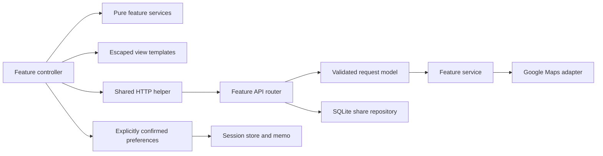

# A short code tour for reviewers

[Project walkthrough](../README.md) · [Architecture and setup](DEVELOPMENT.md) · [Validation log](VALIDATION.md)

## Start with one vertical slice

Follow **commute comparison** from the screen to the provider and back:

1. [Frontend controller](../web/apps/commute/index.js): confirms a destination, captures one schedule, cancels old requests and rejects stale results.
2. [Pure input/question logic](../web/apps/commute/services.js): Japan-time conversion and explicit preference confirmation. [Tests](../web/tests/apps/commute/services.test.js).
3. [View templates](../web/apps/commute/views.js): returned alternatives, unknown values, route attribution and the question.
4. [API router](../server/apps/commute/__init__.py): configuration and rate-limit boundary.
5. [Request models](../server/apps/commute/models.py): bounded shortlist, unique identities, aware timestamps and provider time window.
6. [Service](../server/apps/commute/services.py): one destination/schedule, limited concurrency, independent candidate failures, recommendations within returned routes.
7. [Provider adapter](../server/providers/google_maps.py) and [normalization](../server/providers/routes.py): HTTP details and missing-field handling. No API key reaches the browser.
8. [Contract tests](../server/tests/apps/commute/test_commute.py): injected HTTP transport, no provider calls or keys.

The live Tokyo transit test returned no routes. The code retains that result and a Maps link; successful walking access is not presented as proof of transit coverage.

## Feature map

| Module | User outcome | Frontend | Backend | Focused tests |
| --- | --- | --- | --- | --- |
| Commute | Same destination/time, route alternatives, confirmed intent | [commute](../web/apps/commute/) | [commute](../server/apps/commute/) | [web](../web/tests/apps/commute/) / [API](../server/tests/apps/commute/) |
| Leisure | Actual places → frequency/importance → accepted preference | [leisure](../web/apps/leisure/) | [leisure](../server/apps/leisure/) | [web](../web/tests/apps/leisure/) / [API](../server/tests/apps/leisure/) |
| Scenarios | Explain known costs and route tradeoffs without a total score | [scenarios](../web/apps/scenarios/) | Pure client calculation | [web](../web/tests/apps/scenarios/) |
| Reviews | Match a building, attribute reports, record viewing observations separately | [reviews](../web/apps/reviews/) | [reviews](../server/apps/reviews/) | [web](../web/tests/apps/reviews/) / [API](../server/tests/apps/reviews/) |
| Sharing | Preview/export; expiring links with owner revocation | [sharing](../web/apps/sharing/) | [sharing](../server/apps/sharing/) | [web](../web/tests/apps/sharing/) / [API](../server/tests/apps/sharing/) |
| Existing foundation | Intake, provenance, price research, numeric/AI discovery | [apps](../web/apps/) | [apps](../server/apps/) | [web](../web/tests/) / [API](../server/tests/) |

## Boundaries worth inspecting



- `index.js` owns events and request lifetimes; `services.js` owns testable transformations; `views.js` owns presentation. Scenarios are small enough to keep their controller/template together.
- Backend features do not import one another's business logic. They share the provider adapter and normalized route contract.
- Observations live in feature closures. `context-updated` lets scenarios/advice consume fresh observations without putting provider content into persistent application state.
- `change` describes saved user work. `workspace` describes temporary view/pair changes. Neither navigating a tab nor receiving AI output confirms a requirement.
- Scenarios depend on commute/leisure observation contracts. Advice receives a bounded, candidate-scoped evidence projection. Neither reaches into another controller's DOM.
- Sharing uses an explicit document allowlist. It never dumps the store. Images and eligible chat history are optional **local HTML only**; raw Maps/review responses are not stored or exported.
- Share tokens are bearer read access; deletion needs a separate secret. Both are hashed in SQLite. The owner secret stays in the creator's browser, outside the read link. Share requests keep tokens out of URL logs.

## Reproduce validation

```bash
npm test                 # logic + API contracts; no live provider calls
npm ci                   # optional development formatter
npm run format:check
npm run smoke:browser    # start dev:web and dev:server first
npm run smoke:ui         # interaction checks; only dev:web required
```

The [browser smoke scenario](../scripts/browser-smoke.js) stubs provider results but creates, reads and revokes an actual local-backend share. The [runner](../scripts/run-browser-smoke.mjs) uses a separate temporary browser session. It fails on reported CLI errors, including those with exit status zero. Do not confuse this with live Google/Gemini verification.

For interface work, start with [UI design decisions](UI_DESIGN.md). Cross-feature motion and touch behavior live in `web/static/interactions.css`; its small `web/shared/interactions.js` companion owns presentation state only. The workspace controller owns responsive panel placement; business rules stay in the feature modules.

Feature navigation has one [registry](../web/apps/workspace/navigation.js) for the desktop tabs, grouped mobile select, help text and old route aliases. [Navigation views](../web/apps/workspace/navigation-views.js) renders that configuration; the controller switches panel visibility without recreating feature instances. Routing does not write to preferences or provider state.

## How to add a feature

Create its frontend controller/pure service/view and API router/model/service; register them in [web/app.js](../web/app.js) and [server/app.py](../server/app.py). Add only necessary shared primitives. Add transport-based provider tests, uncertainty/stale-response cases and a short walkthrough. Update [PRODUCT.md](../PRODUCT.md) and [ROADMAP.md](../ROADMAP.md) with separate implementation and live-validation states.
