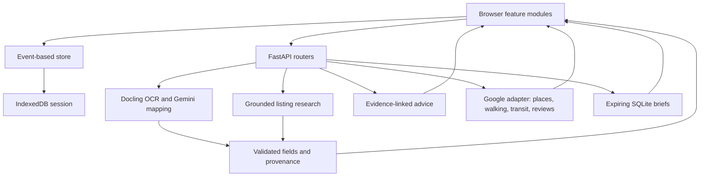

# Development guide

[Project overview](../README.md) · [Product status](../PRODUCT.md) · [Roadmap](../ROADMAP.md)

## Run locally

### Explore without API keys

From the repository root, with Node.js 22+ and Python 3 available:

```bash
npm run dev:web
```

Open **http://127.0.0.1:4173/**. The frontend has no build step or runtime npm dependencies. `npm ci` installs only development formatting tools. Use the recorded candidates, comparison, numeric discovery, memo and local saving. API-dependent actions report unavailable if the server is absent. Local `web/env.js` automatically targets port 8000; hosted origins default to no API.

### Run the backend

Python **3.13** is the version used by CI. From the repository root:

```bash
python3.13 -m venv server/.venv
server/.venv/bin/python -m pip install -r server/requirements-dev.txt
```

On a fresh checkout, copy `server/.env.example` to `server/.env`; preserve an existing configuration. The example starts image extraction in `mock` mode. Start the API and frontend in separate terminals:

```bash
npm run dev:server
```

```bash
npm run dev:web
```

API reference: **http://127.0.0.1:8000/docs**. Health/configuration summary: **http://127.0.0.1:8000/healthz**. Mock extraction returns a labelled fixture; it does not analyze an uploaded image. Research, Maps and advice have separate provider requirements and are not made free/offline by extraction's mock setting.

### Enable live features

Set values only in server environment variables or ignored `.env` files. Native runs load `server/.env`, then root `.env` as a fallback; already-set process variables take precedence. Compose loads `server/.env`, not the root fallback file.

| Setting | Purpose |
| --- | --- |
| `EXTRACTION_MODE=live` | Run Docling OCR and Gemini mapping instead of the extraction fixture. |
| `GEMINI_API_KEY` | Gemini extraction mapping, online research and candidate advice. `GOOGLE_API_KEY` is accepted as an alias. |
| `GOOGLE_MAPS_API_KEY` | Server-side Geocoding, Places API (New), Routes. `GOOGLE_MAP_API` is accepted as an alias. Enable those services in the Google project. |
| `GEMINI_MODEL` | Override the repository default in [config.py](../server/config.py). |
| `GEMINI_THINKING_LEVEL` | Defaults to `low`; supported values are defined in config. |
| `RESEARCH_ENABLED` | Listing-research switch; defaults to `true`. |
| `EXTRACTION_ENABLED` | Image-extraction switch; defaults to `true`. |
| `ALLOWED_ORIGINS` | Comma-separated browser origins allowed by the API. |
| `SHARING_ENABLED` | Enable backend share links (default `true`); local HTML export remains available when disabled. |
| `SHARE_DB_PATH` | SQLite brief storage, default `server/data/shares.sqlite3`; keep it private and persistent. |
| `RATE_LIMIT_PER_MINUTE` | Default 5 requests per client IP per process, shared by the feature endpoints. |

Live operations can incur provider charges. The first OCR run may download/load models; the Docker image prepares them during build. No keys belong in `web/env.js`: it is public JavaScript containing only an API base URL.

### Docker

With Docker/Compose and an appropriate `server/.env`:

```bash
npm run up
```

Open **http://localhost:8080/**; API docs are at **http://localhost:8080/docs**. nginx serves the frontend and proxies the API on the same origin. `npm run down` stops the stack. The container image includes OCR dependencies and is substantially heavier than the static frontend.

## Architecture



| Location | Responsibility |
| --- | --- |
| `web/app.js` | Restore state, load recorded research, register feature modules, attach persistence. |
| `web/apps/intake`, `compare`, `research`, `maps` | Candidate input, comparison, supplements and external observations. |
| `web/apps/commute`, `leisure`, `scenarios`, `reviews`, `sharing` | Separate feature controllers, pure services and views; [code tour](CODE_TOUR.md). |
| `web/apps/advisor`, `priorities`, `needs`, `workspace` | Conversation, explicit preferences, memo and navigation. |
| `web/extensions/ext_store.js`, `session.js` | Store events and local persistence. |
| `web/data/sheets.js`, `research.js` | Recorded examples with provenance; not live API responses. |
| `server/app.py`, `config.py`, `extensions/` | Factory, settings, provider clients, OCR, CORS, logging and rate limits. |
| `server/apps/` | Independent listing, research, maps, advisor, commute, leisure, reviews and sharing endpoint groups. |
| `server/providers/` | Google HTTP adapter, configuration dependency and route normalization. |
| `web/tests`, `server/tests` | Frontend logic and backend validation/provider-contract tests. |
| `docker/`, `.github/workflows/` | Local container stack, CI and static-site publication. |

Add frontend features through `initApp(app)` in `web/app.js`; add API routers through `register_routers()` in `server/app.py`. Keep calculation/matching logic separate from DOM code. Tests can inject Gemini/OCR stubs and Maps transports.

## API surface

| Endpoint | Input / responsibility |
| --- | --- |
| `GET /healthz` | Service and provider-configuration summary, not a successful live-provider check. |
| `POST /api/extract-listing` | Multipart `image`; returns fields, costs, checks, OCR lines, warnings and metadata. |
| `POST /api/research-listing` | URL and/or candidate identity, missing fields and optional room/layout/area context; returns attributed listing offers and eligibility. |
| `POST /api/check-maps` | Candidate address and recognized claims; returns resolved location, walking observations, nearby places and warnings. |
| `POST /api/advise` | Candidate evidence, confirmed priorities and conversation; returns cited insights/questions/options and proposed preferences. |

| `POST /api/destinations` | Search places for explicit destination confirmation. |
| `POST /api/commutes` | Up to 6 candidates, confirmed destination ID, aware `at` and optional later `returnAt`, mode/objective; `returnTrip` has independent routes/status and reversed origin/destination. |
| `POST /api/leisure` | Nearby categories or a confirmed named destination; dated places and WALK routes. |
| `POST /api/reviews/web` | Automatic room → building → nearby web search; grounded summaries and explicit source identity/distance. Requires Gemini + `RESEARCH_ENABLED`; Maps is additionally required if the room/building tiers are empty and nearby fallback is needed. |
| `POST /api/reviews/search` | Match building name and origin against returned places. |
| `POST /api/reviews` | Recheck confirmed building identity, then return attributed relevance-ordered posts. |
| `POST /api/shares` | Store an allowlisted brief for 1–7 days; return separate read and deletion secrets. |
| `POST /api/shares/read` | Read by token; expires on server time; response is not cached. |
| `POST /api/shares/revoke` | Delete with the read token and owner secret. |

See the running `/docs` for exact schemas. Share reads use POST so bearer tokens do not enter URL/access logs.

## Data boundaries

- Image uploads are processed by the backend in request memory; Gemini receives recognized text rather than image pixels. The browser can persist uploaded image blobs locally.
- Research uses provider retrieval tools. Facts retain their source and listing/retrieval dates. Exact-unit matching and reference-price separation protect comparisons from unrelated room prices.
- Advice includes a `focus` view (`cost`, `space`, `access`, `living`, `all`; defaults to `all`) without treating navigation as a confirmed preference. On mobile it scopes candidate facts and the request memo to the selected pair. It sends available Maps observations and user answers to Gemini. Citation validation does not guarantee interpretation accuracy; preference changes need user confirmation.
- Commute, leisure, building-review and Maps results remain in memory. Conversations reproducing those observations are not persisted; accepted preferences are saved. Provider attribution links and retrieval times remain visible during the session.
- Local saving is not cloud backup or a shared account. Footer deletion clears the local candidate session and resets the sample experience. Share-owner controls are kept separately in localStorage so created links can still be revoked; deleting a session does not revoke a share.

## Validation

```bash
npm test
npm run test:web
npm run test:server
git diff --check
```

The default test suite uses provider stubs and does not require live API keys. Snapshot on **2026-09-22:** 114 frontend + 135 backend passed, 2 real-OCR tests skipped. Enable optional real OCR with `RUN_OCR_TESTS=1 npm run test:server`; it requires OCR dependencies/models. Provider reliability must be tested separately.

With both development servers running, `npm run smoke:browser` uses a separate Playwright CLI session. Provider calls are stubbed; sharing uses the real local backend and cleans up its link. It downloads a test HTML brief under ignored `output/playwright/`. The first run downloads the CLI/browser if needed.

With just the frontend running, `npm run smoke:ui` checks native dialog/focus behavior, keyboard and reduced-motion paths, touch field sizing, responsive panel restoration and dark mode. These are Chromium/emulated-touch checks; physical phone behavior remains a separate check. See [interface craft](UI_DESIGN.md) for the design rationale and file ownership.

`npm ci && npm run format:check` checks the new feature modules with pinned Prettier. `npm run format` formats them. Backend feature code follows Ruff formatting (`uvx --from ruff==0.12.12 ruff format server/providers server/apps/commute server/apps/leisure server/apps/reviews server/apps/sharing`).

Other commands:

```bash
npm run smoke
npm run record:sheets
npm run record:sheets -- --gemini
```

`smoke` exercises a running API with a fixture. `record:sheets` regenerates recorded demo data using real OCR and checked ground-truth mappings. `--gemini` invokes the live model and evaluates mappings against fixtures; it can incur charges and rewrites generated data. Original `assets/Apt*.jpg` files are ignored; published derivatives in `web/static/sheets/` mask contact details.

README screenshots were captured from the actual local UI. The comparison screenshot shows the latest interface before answering; the discovery/memo walkthrough shows a confirmed flexible ¥110,000 monthly limit. They use contextual numeric questions, not a synthetic Gemini response. See [product validation](../PRODUCT.md#validation-and-release-state) for live-provider limitations.

## Deployment state

GitHub Actions [CI](../.github/workflows/ci.yml) defines frontend/backend tests, API-image build and Compose validation. [Pages](../.github/workflows/pages.yml) publishes `web/` without tests after frontend tests, on matching `main` changes or manual dispatch. Documentation-only changes do not automatically trigger the Pages workflow.

Pushing frontend changes to `main` triggers the Pages workflow. The repository contains the full app; the Pages environment serves static files. GitHub Pages cannot host the Python API. After deploying a backend, set repository variable `RENTAL_API_URL`; Pages validates live configuration and CORS before injecting that public address into its built `env.js`. Keys remain server-side. With no variable, the deployment remains frontend-only. Compose uses [same-origin configuration](../docker/web/env.js). See the [public deployment and live-film checklist](DEPLOYMENT.md).

## Share storage and deployment limits

The API defaults to `server/data/shares.sqlite3`. The directory is excluded from Git and Docker build context. Compose mounts the `share-data` volume; the container user can write `/app/data`. Back up and restrict access to this private data independently of source code. `SHARING_ENABLED=false` disables share endpoints; the export workflow still works.

Tokens carry read access; the owner has a separate delete secret. SQLite stores their SHA-256 hashes, enforces expiry, deletes expired rows during access and limits active documents to 1,000. Expiry uses server time. This is a single-instance prototype; multiple replicas need a shared repository and distributed rate limiting. Revocation cannot remove copies already downloaded by recipients.

Share pages use `share.html#token`, no indexing and no referrer. The reader uses the deployment's configured API URL. A link to localhost is only usable on that machine; a public link needs both a public frontend and reachable HTTPS API. No public backend was provisioned by a Git push.

Review fallback has a 180 s overall backend deadline and a 190 s browser timeout. Each of the at most three search stages makes a grounded search call and, when citations exist, a mapping call. Nearby discovery uses a precise candidate geocode and residential Nearby Search; only the nearest three eligible returned buildings within 300 m are researched. This is bounded discovery, not exhaustive coverage. Failures stop expansion and stay errors. Legacy share-note fields are accepted for compatibility but excluded from newly stored output.

## Commute defaults and live Maps verification

`web/apps/commute/destinations.js` owns the eight curated Tokyo hubs, candidate-area suggestion and next-weekday defaults (the station-matching helper remains for API clients). Holidays are not detected. A suggestion does not enter saved requirements. `08:00` means arrival at the destination; `18:00` means departure from it, both interpreted as Japan time regardless of the browser timezone. Other schedules remain editable.

`returnAt` is optional for API compatibility, must follow `at`, and stays within the provider time window. Each leg has independent failure handling; a failed return does not discard an available outbound route. Weekly round-trip estimates require both directions. This is an optional backend contract, not the current commute UI.

Google [excludes Japan transit from Routes API coverage](https://developers.google.com/maps/faq#transit_directions_countries). Places, Geocoding and WALK availability do not imply electric-rail/bus routing availability. Live time comparison for Japan needs a different transit provider.

To repeat the bounded, **billed** check with configured credentials, from `server/` run:

```sh
.venv/bin/python -m commands.check_maps
```

It searches Shibuya station, uses the first exact Tokyo match as a diagnostic target (reports the matching entity count), checks all three public sample buildings in both directions, and independently checks WALK for one building. Only status summaries are printed; keys and full provider route data are neither printed nor persisted. The direct-link UI instead asks users to verify resolved locations inside Google Maps. `/healthz` reports key configuration only, not live capability.

### Keyless commute handoff

`web/apps/commute/links.js` constructs official Google Maps direction URLs. It sets only `api=1`, `origin`, `destination`, and `travelmode`; return links reverse the endpoints. The controller does not call Places or Routes, so this flow works on GitHub Pages. Date/time controls are reminders only: [official universal URLs](https://developers.google.com/maps/documentation/urls/get-started) do not support arrival/departure dates or times. Do not add undocumented encoded `data` blobs or imply that a click returns a route to the app.

An address is preferred; a building name with a known district is a visibly tentative fallback. Missing locations never use the device location. Candidate changes rebuild links. Destination/schedule are transient; the opt-in share field includes only an explicitly selected destination, never an inferred workplace. `commuteObservation()` returns `null`; scenarios/advice receive no fabricated durations or evidence.

## README video

The static chaptered player lives at `web/demo/`; recording-only fixtures remain in `scripts/`. Use `npm run dev:demo` for byte-range video playback on port 4174 and `npm run smoke:demo` to check it. [Recording, encoding and simulation boundaries](DEMO.md).
