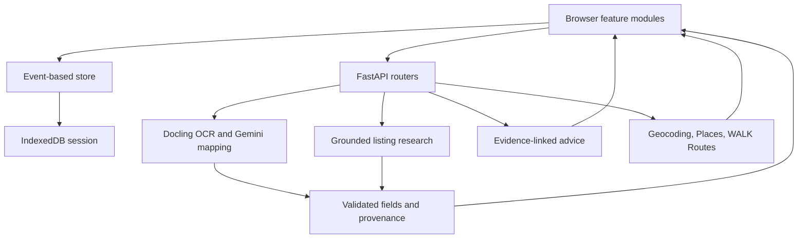

# Development guide

[Project overview](../README.md) · [Product status](../PRODUCT.md) · [Roadmap](../ROADMAP.md)

## Run locally

### Explore without API keys

From the repository root, with Node.js 22+ and Python 3 available:

```bash
npm run dev:web
```

Open **http://127.0.0.1:4173/**. The frontend has no build step or npm dependencies to install. Use the recorded candidates, comparison, numeric discovery, memo and local saving. API-dependent actions report unavailable if the server is absent. Local `web/env.js` automatically targets port 8000; hosted origins default to no API.

### Run the backend

Python **3.13** is the version used by CI. From the repository root:

```bash
python3.13 -m venv server/.venv
server/.venv/bin/python -m pip install -r server/requirements-dev.txt
```

On a fresh checkout, copy `server/.env.example` to `server/.env`; preserve an existing configuration. The example starts image extraction in `mock` mode. Start the API and frontend in separate terminals:

```bash
npm run dev:server
```

```bash
npm run dev:web
```

API reference: **http://127.0.0.1:8000/docs**. Health/configuration summary: **http://127.0.0.1:8000/healthz**. Mock extraction returns a labelled fixture; it does not analyze an uploaded image. Research, Maps and advice have separate provider requirements and are not made free/offline by extraction's mock setting.

### Enable live features

Set values only in server environment variables or ignored `.env` files. Native runs load `server/.env`, then root `.env` as a fallback; already-set process variables take precedence. Compose loads `server/.env`, not the root fallback file.

| Setting | Purpose |
| --- | --- |
| `EXTRACTION_MODE=live` | Run Docling OCR and Gemini mapping instead of the extraction fixture. |
| `GEMINI_API_KEY` | Gemini extraction mapping, online research and candidate advice. `GOOGLE_API_KEY` is accepted as an alias. |
| `GOOGLE_MAPS_API_KEY` | Server-side Geocoding, Places API (New), Routes. `GOOGLE_MAP_API` is accepted as an alias. Enable those services in the Google project. |
| `GEMINI_MODEL` | Override the repository default in [config.py](../server/config.py). |
| `GEMINI_THINKING_LEVEL` | Defaults to `low`; supported values are defined in config. |
| `RESEARCH_ENABLED` | Listing-research switch; defaults to `true`. |
| `EXTRACTION_ENABLED` | Image-extraction switch; defaults to `true`. |
| `ALLOWED_ORIGINS` | Comma-separated browser origins allowed by the API. |
| `RATE_LIMIT_PER_MINUTE` | Default 5 requests per client IP per process, shared by the feature endpoints. |

Live operations can incur provider charges. The first OCR run may download/load models; the Docker image prepares them during build. No keys belong in `web/env.js`: it is public JavaScript containing only an API base URL.

### Docker

With Docker/Compose and an appropriate `server/.env`:

```bash
npm run up
```

Open **http://localhost:8080/**; API docs are at **http://localhost:8080/docs**. nginx serves the frontend and proxies the API on the same origin. `npm run down` stops the stack. The container image includes OCR dependencies and is substantially heavier than the static frontend.

## Architecture



| Location | Responsibility |
| --- | --- |
| `web/app.js` | Restore state, load recorded research, register feature modules, attach persistence. |
| `web/apps/intake`, `compare`, `research`, `maps` | Candidate input, comparison, supplements and external observations. |
| `web/apps/advisor`, `priorities`, `needs`, `workspace` | Conversation, explicit preferences, memo and navigation. |
| `web/extensions/ext_store.js`, `session.js` | Store events and local persistence. |
| `web/data/sheets.js`, `research.js` | Recorded examples with provenance; not live API responses. |
| `server/app.py`, `config.py`, `extensions/` | Factory, settings, provider clients, OCR, CORS, logging and rate limits. |
| `server/apps/listing`, `research`, `maps`, `advisor` | Independent endpoint groups with structured contracts. |
| `web/tests`, `server/tests` | Frontend logic and backend validation/provider-contract tests. |
| `docker/`, `.github/workflows/` | Local container stack, CI and static-site publication. |

Add frontend features through `initApp(app)` in `web/app.js`; add API routers through `register_routers()` in `server/app.py`. Keep calculation/matching logic separate from DOM code. Tests can inject Gemini/OCR stubs and Maps transports.

## API surface

| Endpoint | Input / responsibility |
| --- | --- |
| `GET /healthz` | Service and provider-configuration summary, not a successful live-provider check. |
| `POST /api/extract-listing` | Multipart `image`; returns fields, costs, checks, OCR lines, warnings and metadata. |
| `POST /api/research-listing` | URL and/or candidate identity, missing fields and optional room/layout/area context; returns attributed listing offers and eligibility. |
| `POST /api/check-maps` | Candidate address and recognized claims; returns resolved location, walking observations, nearby places and warnings. |
| `POST /api/advise` | Candidate evidence, confirmed priorities and conversation; returns cited insights/questions/options and proposed preferences. |

See the running `/docs` for the exact schemas. There is currently no commute, leisure-recommendation, review-ingestion or cloud-sharing endpoint.

## Data boundaries

- Image uploads are processed by the backend in request memory; Gemini receives recognized text rather than image pixels. The browser can persist uploaded image blobs locally.
- Research uses provider retrieval tools. Facts retain their source and listing/retrieval dates. Exact-unit matching and reference-price separation protect comparisons from unrelated room prices.
- Advice includes a `focus` view (`cost`, `space`, `access`, `living`, `all`; defaults to `all`) without treating navigation as a confirmed preference. On mobile it scopes candidate facts and the request memo to the selected pair. It sends available Maps observations and user answers to Gemini. Citation validation does not guarantee interpretation accuracy; preference changes need user confirmation.
- Maps results remain in memory. Conversations reproducing those observations are not persisted; accepted preferences are saved. Provider attribution links and retrieval times remain visible during the session.
- Local saving is not cloud backup or a shared account. Footer deletion clears the local session and resets the sample experience.

## Validation

```bash
npm test
npm run test:web
npm run test:server
git diff --check
```

The default test suite uses provider stubs and does not require live API keys. Snapshot on **2026-09-22:** 86 frontend + 83 backend passed, 2 real-OCR tests skipped. Enable optional real OCR with `RUN_OCR_TESTS=1 npm run test:server`; it requires OCR dependencies/models. Provider reliability must be tested separately.

Other commands:

```bash
npm run smoke
npm run record:sheets
npm run record:sheets -- --gemini
```

`smoke` exercises a running API with a fixture. `record:sheets` regenerates recorded demo data using real OCR and checked ground-truth mappings. `--gemini` invokes the live model and evaluates mappings against fixtures; it can incur charges and rewrites generated data. Original `assets/Apt*.jpg` files are ignored; published derivatives in `web/static/sheets/` mask contact details.

Current README screenshots were captured from the actual local UI. The workspace/discovery/memo walkthrough uses contextual numeric questions, with a confirmed flexible ¥110,000 monthly limit. It is not a synthetic Gemini response. See [product validation](../PRODUCT.md#validation-and-release-state) for live-provider limitations.

## Deployment state

GitHub Actions [CI](../.github/workflows/ci.yml) defines frontend/backend tests, API-image build and Compose validation. [Pages](../.github/workflows/pages.yml) publishes `web/` without tests after frontend tests, on matching `main` changes or manual dispatch. Documentation-only changes do not automatically trigger the Pages workflow.

The public demo currently serves an earlier interface. This documentation update does not publish the new build. GitHub Pages cannot host the Python API: live features require an API deployment, a public base URL in `web/env.js`, server-side secrets, and allowed origins matching the frontend. Compose uses [same-origin configuration](../docker/web/env.js).
