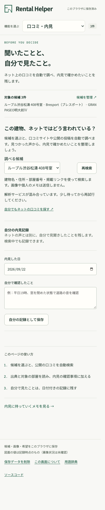
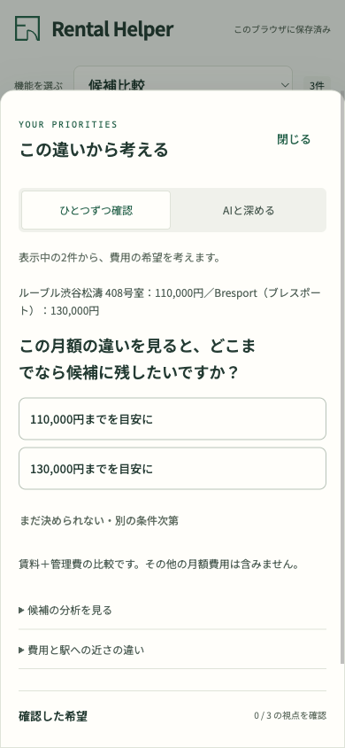

# Interface craft

The workspace should feel like a calm comparison notebook: clear amounts, restrained green accents and original listing evidence. The comparison is the main surface, contextual questions are its inspector, and the brief is the takeaway. Motion explains occasional overlays and acknowledges a press; repeated tab and keyboard actions stay immediate.

This pass applies [Emil Kowalski's design engineering skill](https://github.com/emilkowalski/skills/blob/85e8e2363b713506e1d5b6e07a0eb2da66be1bc3/skills/emil-design-eng/SKILL.md) and [mobile-native skill](https://github.com/emilkowalski/skills/blob/85e8e2363b713506e1d5b6e07a0eb2da66be1bc3/skills/mobile-native/SKILL.md), reviewed on September 22, 2026. The installed skills are development guidance; the shipped frontend has no dependency on them or an animation library.

| Before | After | Why |
| --- | --- | --- |
| Similar emphasis across navigation, values and questions | Selected perspective on a quiet segmented surface; larger monthly amounts; a distinct question inspector | Make the current comparison and next action easier to find. |
| Whole workspace animates on tab changes | Immediate tab changes | Repeated comparison should not wait for decoration. |
| Every dialog enters from below; closes abruptly | Centered dialogs, right-hand sources and mobile sheets use their own direction; 240 ms entry / 140 ms exit | Preserve spatial context without delaying native controls. |
| Hover styling also applies to touch | Hover gated by input capability; immediate press feedback | Avoid sticky mouse states after tapping. |
| Small nested form fonts | Touch inputs/selects/textareas are at least 16 px; date controls have sufficient width | Avoid iOS input zoom without disabling user zoom. |
| Mobile panel content immediately moves away on close | It remains through the CSS exit and returns to the inspector on desktop | Avoid an empty exit frame; preserve content on resize. |
| Additional-input disclosure stays open after selection | Close on action, outside click or Escape; restore focus on Escape | Finish the interaction without leaving stray controls open. |
| New-link intake evaluates a fingerprint without a candidate | Only read cached research when it exists | Keep the primary link-entry dialog available for a new candidate. |
| Commute/leisure/scenarios hidden inside access; reviews inside equipment; sharing below the memo | Eight visible desktop tabs and a grouped phone dropdown; each feature opens its own page with forms already visible | Make features discoverable without knowing where they used to be nested. |
| No route identity for a feature | Dedicated hash links, Back/Forward and consistent title/selection | Let users return to the same tool and link directly to it. |

## Typography and density

The reading baseline is **16 px**, supporting copy is generally **14–15 px**, and page titles use **26–32 px**. Compact table annotations retain **12–13 px** on narrow phones. Shared tokens live in `app.css`; workspace and feature styles own their respective density and breakpoints.

| Before | After |
| --- | --- |
| Small, similarly weighted navigation labels | Larger tabs with a filled selected state; the phone retains a native feature selector |
| Promotional titles and repeated English captions | Short functional titles matching the navigation |
| Repeated candidate names, price ranges and empty-priority instructions | Candidate counts, the actual comparison values, and priorities only after a choice/pending item exists |
| Always-visible help beside every form | One main column; usage steps in a native disclosure below the controls/results |
| Export actions below a long preview | Export/share controls above the preview, alongside explicit inclusion options |
| Long save-status text crowds the phone header | Compact success status; storage failures remain fully reported |

Source links, reference-price labels, unknown values, nearby-review scope and privacy choices remain visible. The inspector labels **比較から選ぶ / AI 分析** make both discovery methods explicit. Increasing font size exposed a 320 px perspective-tab overflow; the tab strip now scrolls within its own width without widening the document. Keyboard tab navigation remains immediate.

## Feature navigation

The eight destinations are **候補比較 / 通勤 / 駅・買い物 / 余暇 / 口コミ分析 / 暮らしの試算 / 条件メモ / 共有・出力**. On mobile, a native grouped select replaces the tab row so every feature remains discoverable at 320 px. Each feature page shows a functional title, compact candidate count, its controls/results, and an optional **使い方を見る** disclosure with three steps and a relevant next destination. The review page is automatic analysis; the decision brief is generated and read-only. There are no manual diary or free-text requirement controls.

Navigation toggles existing panels, so a draft or retrieved result survives switching. It never changes a confirmed preference. The reviews page starts an automatic public-web search when opened or when its candidate changes; a 30-minute session cache prevents repeated calls while navigating. Other tabs retain their explicit provider actions. Browser refresh restores the route but follows the existing rules for temporary Maps content. The comparison's mobile pair picker does not limit the standalone essentials page.

## Ownership

- [workspace.css](../web/static/workspace.css): workspace layout, type, surfaces, responsive composition.
- [features.css](../web/static/features.css): shared feature form/disclosure layout.
- [interactions.css](../web/static/interactions.css): motion tokens, native dialog transitions, pointer feedback, safe areas and accessibility overrides. Unsupported discrete transitions fall back to immediate native dialogs.
- [interactions.js](../web/shared/interactions.js): ephemeral input modality and additional-input disclosure dismissal. It neither reads nor writes tenant preferences.
- [workspace controller](../web/apps/workspace/index.js): native bottom-panel placement and focus, including open/closed resize cases.
- [navigation registry](../web/apps/workspace/navigation.js): feature labels, help text, next destinations and legacy route aliases. [Navigation views](../web/apps/workspace/navigation-views.js) generates both desktop/mobile controls from that registry.
- [navigation.css](../web/static/navigation.css): feature-page hierarchy and responsive navigation, separate from business modules.

No duplicate tab lists, simulated gestures or custom modal focus traps are introduced. Native buttons, tabs, disclosures and `<dialog>` retain their existing semantics. Text remains selectable; selection suppression applies to controls only. Reduced motion and keyboard use disable transitions.

## Reproduce the interaction checks

Start `npm run dev:web`, then run `npm run smoke:ui`. The [browser scenario](../scripts/browser-ui-smoke.js) uses an isolated Chromium session and requires no API credentials. It checks keyboard tabs, disclosure dismissal, focus return, interrupted dialog open/close, reduced motion, open/closed sheet resizing, 320/390/760 px touch layouts, 16 px form controls and dark mode. `npm run smoke:browser` additionally exercises the existing feature workflow with stubbed providers and a real local sharing API.

Navigation checks additionally cover all eight desktop/mobile destinations, one selected tab, dropdown synchronization, draft preservation across Back/Forward, reload/deep links, legacy anchors and overflow on all eight pages at 320/390/760 px. Typography checks additionally cover 761/800/1024 px desktop navigation, the 16 px body baseline, and opening/closing the folded usage steps. The full feature check now traverses the top tabs from commute through leisure, scenarios, reviews, memo and sharing.

Mobile question panel — actual recorded-candidate flow

Browser emulation is not a physical-device sign-off. The soft keyboard, actual iPhone safe areas, touch latency and overscroll still need a phone check, including landscape orientation. No live provider result or tenant usability improvement is inferred from these UI checks.

## Automatic review discovery

The mobile review screenshot uses a stubbed successful empty response to illustrate layout; it is not evidence of a live building search. The candidate selector is the entry point: choosing a home starts research, with a visible status and a manual refresh button. Results show short, source-linked AI summaries with building/unit scope and a posting date only when available. Unmatched buildings, listing copy and inaccessible pages are in a separate disclosure. No overall star score is inferred. Keyword-linked questions require an explicit click to enter the generated brief. The brief is read-only; preferences are refined through candidate-based choices rather than typed requirements.

A successful search without usable reviews leaves the evidence area blank with a small completed status. Provider failure and pending search remain explicit states. A direct web-search link remains available. Error/results are cached only in memory; changing a candidate cancels and ignores old responses. The automated browser checks stub review retrieval so opening the new page never spends provider quota during those tests.

The retrieval ladder is visible beside the candidate selector: **この部屋 → 同じ建物 → 近隣300m以内**. Nearby summaries have a distinct reference notice, the actual building name/address, a Maps location link and a straight-line distance. They cannot be read as reports about the target apartment. Search stops as soon as a closer evidence tier has usable reviews.

## Destination-first commute

| Before | After |
| --- | --- |
| Empty destination search | Eight Tokyo hubs, with Shibuya suggested from these candidates' areas; custom address search remains an explicit menu option |
| Single 09:00 schedule | Next Japan weekday, 08:00 destination arrival and 18:00 departure for the return; times remain editable |
| Five settings open at once | Date and morning/evening first; transport mode, frequency and objective under a native disclosure |
| Single result per candidate | Separate outbound/return legs, status counts and direction-specific Maps links |

The suggestion is a transparent district heuristic, not an inferred job or a shortest-time claim. Multiple exact station matches stay selectable. Destination changes abort pending searches/route calls and clear old observations. Phones put the two time fields side by side; defaults never become confirmed requirements automatically. Japan transit is explicitly marked unavailable under Google's published coverage; no WALK substitution or fabricated durations appear.
